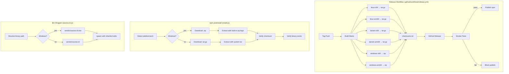

# Design Document: Cross-Platform npm Install

## Overview

This design extends the `@zavora-ai/zavora-cli` npm package to support Windows alongside the existing macOS and Linux platforms. The changes span four areas:

1. **CI pipeline** — Add Windows build targets and zip packaging to the release workflow
2. **Install script** — Add Windows platform resolution, zip extraction, and `.exe` handling
3. **Bin wrapper** — Platform-aware binary path resolution
4. **Smoke tests** — Post-publish validation on all three OS families

The design preserves all existing Unix behavior and introduces Windows-specific paths only where platform differences require them (archive format, binary extension, extraction method).

## Architecture



## Components and Interfaces

### 1. Release Workflow Changes

**File:** `.github/workflows/release.yml`

The build matrix gains two Windows entries:

| Runner | Rust Target | Artifact Suffix | Archive Format |
|--------|------------|-----------------|----------------|
| `ubuntu-latest` | `x86_64-unknown-linux-gnu` | `linux-x64` | `.tar.gz` |
| `ubuntu-latest` | `aarch64-unknown-linux-gnu` | `linux-arm64` | `.tar.gz` |
| `macos-14` | `x86_64-apple-darwin` | `darwin-x64` | `.tar.gz` |
| `macos-14` | `aarch64-apple-darwin` | `darwin-arm64` | `.tar.gz` |
| `windows-latest` | `x86_64-pc-windows-msvc` | `windows-x64` | `.zip` |
| `windows-latest` | `aarch64-pc-windows-msvc` | `windows-arm64` | `.zip` |

**Packaging step changes:**
- Windows builds produce `zavora-cli-vX.Y.Z-windows-{arch}.zip` containing `zavora-cli.exe`
- Unix builds continue producing `zavora-cli-vX.Y.Z-{suffix}.tar.gz` containing `zavora-cli`
- The checksums manifest step uses `sha256sum` (or platform equivalent) across all archive types

**Windows-arm64 build note:** The `aarch64-pc-windows-msvc` target cross-compiles on `windows-latest` (x64 runner). Rust supports this as a tier 2 target. The runner installs the target via `rustup target add`.

### 2. Install Script Changes

**File:** `npm/zavora-cli/scripts/install.js`

#### SUPPORTED_ARTIFACTS update

```javascript
const SUPPORTED_ARTIFACTS = {
  linux:  { x64: "linux-x64",   arm64: "linux-arm64" },
  darwin: { x64: "darwin-x64",  arm64: "darwin-arm64" },
  win32:  { x64: "windows-x64", arm64: "windows-arm64" }
};
```

#### Platform-aware archive resolution

```javascript
function resolveArchiveInfo() {
  const suffix = resolveArtifactSuffix();
  if (!suffix) return null;
  const isWindows = process.platform === "win32";
  const ext = isWindows ? "zip" : "tar.gz";
  const binaryName = isWindows ? "zavora-cli.exe" : "zavora-cli";
  return { suffix, ext, binaryName };
}
```

#### Zip extraction (Windows)

Instead of shelling out to `tar`, the install script will use Node.js built-in `zlib` for decompression. For zip files, we implement a minimal zip extractor using the zip local file header format, since the package has no runtime dependencies and we want to keep it that way.

The zip extraction function:
1. Reads the zip file into a buffer
2. Walks local file headers (signature `0x04034b50`)
3. For each entry, extracts the filename and compressed data
4. Decompresses using `zlib.inflateRawSync` (deflate method) or reads stored data directly
5. Writes the extracted file to the destination directory

This approach avoids adding npm dependencies and works on all Node.js 18+ versions.

```javascript
function unpackZip(zipPath, destination) {
  fs.rmSync(destination, { recursive: true, force: true });
  fs.mkdirSync(destination, { recursive: true });

  const buf = fs.readFileSync(zipPath);
  let offset = 0;

  while (offset < buf.length - 4) {
    const sig = buf.readUInt32LE(offset);
    if (sig !== 0x04034b50) break;

    const compressionMethod = buf.readUInt16LE(offset + 8);
    const compressedSize = buf.readUInt32LE(offset + 18);
    const fileNameLen = buf.readUInt16LE(offset + 26);
    const extraLen = buf.readUInt16LE(offset + 28);
    const fileName = buf.toString("utf8", offset + 30, offset + 30 + fileNameLen);
    const dataStart = offset + 30 + fileNameLen + extraLen;
    const rawData = buf.subarray(dataStart, dataStart + compressedSize);

    if (!fileName.endsWith("/")) {
      const outPath = path.join(destination, path.basename(fileName));
      let data;
      if (compressionMethod === 0) {
        data = rawData;
      } else if (compressionMethod === 8) {
        data = require("node:zlib").inflateRawSync(rawData);
      } else {
        throw new Error(`Unsupported zip compression method: ${compressionMethod}`);
      }
      fs.writeFileSync(outPath, data);
    }

    offset = dataStart + compressedSize;
  }
}
```

#### Updated unpack dispatch

```javascript
function unpackArchive(archivePath, destination, archiveExt) {
  if (archiveExt === "zip") {
    unpackZip(archivePath, destination);
  } else {
    fs.rmSync(destination, { recursive: true, force: true });
    fs.mkdirSync(destination, { recursive: true });
    execFileSync("tar", ["-xzf", archivePath, "-C", destination], { stdio: "inherit" });
  }
}
```

### 3. Bin Wrapper Changes

**File:** `npm/zavora-cli/bin/zavora-cli.js`

```javascript
const binaryName = process.platform === "win32" ? "zavora-cli.exe" : "zavora-cli";
const binaryPath = path.join(__dirname, "..", "vendor", binaryName);
```

No other changes needed — `spawn` works cross-platform, and `stdio: "inherit"` is platform-agnostic.

### 4. Smoke Test Job

**Added to:** `.github/workflows/release.yml`

A new `smoke-test` job runs after `publish-release` and before `publish-npm`:

```yaml
smoke-test:
  needs: [resolve, publish-release]
  strategy:
    fail-fast: false
    matrix:
      include:
        - runner: ubuntu-latest
          name: linux-x64
        - runner: macos-14
          name: macos-arm64
        - runner: windows-latest
          name: windows-x64
  runs-on: ${{ matrix.runner }}
  steps:
    - uses: actions/checkout@v4
      with:
        ref: ${{ needs.resolve.outputs.source_ref }}
    - uses: actions/setup-node@v4
      with:
        node-version: 20
    - name: Install globally from local package
      run: npm install -g ./npm/zavora-cli
    - name: Verify version output
      run: |
        OUTPUT=$(zavora-cli --version)
        echo "Got: $OUTPUT"
        echo "$OUTPUT" | grep -q "${{ needs.resolve.outputs.release_tag }}"
```

The `publish-npm` job gains `needs: [resolve, smoke-test]` so it only runs after all smoke tests pass.

### 5. Package Metadata

**File:** `npm/zavora-cli/package.json`

```json
{
  "os": ["darwin", "linux", "win32"],
  "cpu": ["x64", "arm64"]
}
```

## Data Models

No new data models are introduced. The existing structures are extended:

### SUPPORTED_ARTIFACTS Map

```
{
  [platform: string]: {
    [arch: string]: string  // artifact suffix
  }
}
```

Extended from 2 platforms (linux, darwin) to 3 (linux, darwin, win32).

### Archive Info

New internal structure returned by `resolveArchiveInfo()`:

```
{
  suffix: string,     // e.g. "windows-x64"
  ext: string,        // "zip" or "tar.gz"
  binaryName: string  // "zavora-cli.exe" or "zavora-cli"
}
```

### Release Artifact Naming Convention

| Platform | Format | Example |
|----------|--------|---------|
| Linux | `zavora-cli-{tag}-{suffix}.tar.gz` | `zavora-cli-v1.2.0-linux-x64.tar.gz` |
| macOS | `zavora-cli-{tag}-{suffix}.tar.gz` | `zavora-cli-v1.2.0-darwin-arm64.tar.gz` |
| Windows | `zavora-cli-{tag}-{suffix}.zip` | `zavora-cli-v1.2.0-windows-x64.zip` |


## Correctness Properties

*A property is a characteristic or behavior that should hold true across all valid executions of a system — essentially, a formal statement about what the system should do. Properties serve as the bridge between human-readable specifications and machine-verifiable correctness guarantees.*

### Property 1: Platform resolution correctness

*For any* supported platform/architecture pair (`darwin/x64`, `darwin/arm64`, `linux/x64`, `linux/arm64`, `win32/x64`, `win32/arm64`), the resolution functions shall produce a consistent triple of (artifact suffix, archive extension, binary name) where:
- Windows platforms resolve to `.zip` extension and `zavora-cli.exe` binary name
- Unix platforms resolve to `.tar.gz` extension and `zavora-cli` binary name
- The artifact suffix matches the expected naming convention (e.g., `windows-x64`, `linux-arm64`)

**Validates: Requirements 2.2, 2.7, 2.8, 3.1, 3.2**

### Property 2: Zip extraction round-trip

*For any* valid file content (arbitrary bytes), creating a zip archive containing that content and then extracting it with `unpackZip` shall produce a file with identical content to the original.

**Validates: Requirements 2.3**

### Property 3: Checksum verification correctness

*For any* file content, computing the SHA-256 hash and then verifying the file against that hash shall succeed. Verifying the file against any different hash shall fail.

**Validates: Requirements 2.5, 2.6**

## Error Handling

| Scenario | Behavior | Requirement |
|----------|----------|-------------|
| Unsupported platform/arch | Install_Script prints error with fallback suggestion (`cargo install zavora-cli`) and exits with code 1 | 2.1 |
| Download failure (network error, HTTP error) | Install_Script prints error with URL and fallback suggestion, exits with code 1 | 2.2 |
| Checksum mismatch | Install_Script prints "checksum mismatch" error, aborts, exits with code 1 | 2.5, 2.6 |
| Checksums manifest unavailable | Install_Script continues without verification (existing behavior preserved) | 2.5 |
| Unsupported zip compression method | Install_Script throws error with method number, caught by main handler, exits with code 1 | 2.3 |
| Binary not found after extraction | Install_Script prints error naming the expected binary, exits with code 1 | 2.7, 2.8 |
| Binary not found at runtime | Bin_Wrapper prints reinstall suggestion, exits with code 1 | 3.4 |
| Binary spawn failure | Bin_Wrapper prints error message, exits with code 1 | 3.3 |
| Smoke test failure | Release_Workflow blocks npm publish step | 5.4 |

## Testing Strategy

### Unit Tests

Unit tests cover specific examples and edge cases:

- **Platform resolution examples**: Verify each of the 6 supported platform/arch combos returns the correct suffix, extension, and binary name. Verify unsupported combos (e.g., `freebsd/x64`) return null.
- **Checksum parsing**: Verify `parseExpectedChecksum` correctly extracts hashes from a checksums manifest with various formats (spaces, asterisk prefixes).
- **Binary wrapper missing binary**: Verify the wrapper exits with code 1 and prints an error when the binary doesn't exist.
- **Package.json validation**: Verify `os` includes `win32`, `darwin`, `linux` and `cpu` includes `x64`, `arm64`.

### Property-Based Tests

Property-based tests validate universal correctness properties using a library like `fast-check`:

- **Property 1 (Platform resolution)**: Generate random platform/arch pairs from the supported set. Assert the resolved triple is internally consistent (Windows → zip + .exe, Unix → tar.gz + no extension).
  - **Feature: cross-platform-npm-install, Property 1: Platform resolution correctness**
  - Minimum 100 iterations

- **Property 2 (Zip round-trip)**: Generate random binary content (arbitrary byte arrays). Create a zip archive in memory, extract with `unpackZip`, assert extracted content equals original.
  - **Feature: cross-platform-npm-install, Property 2: Zip extraction round-trip**
  - Minimum 100 iterations

- **Property 3 (Checksum verification)**: Generate random file content. Compute SHA-256. Assert verification passes with correct hash and fails with a mutated hash.
  - **Feature: cross-platform-npm-install, Property 3: Checksum verification correctness**
  - Minimum 100 iterations

### Testing Library

- **Property-based testing**: `fast-check` (JavaScript/Node.js PBT library)
- **Test runner**: Node.js built-in test runner (`node:test`) or `vitest` if already in use
- **Assertions**: Node.js `node:assert` or test runner's built-in assertions

### CI Integration

Smoke tests run as a GitHub Actions job on real platform runners (ubuntu-latest, macos-14, windows-latest), validating the full install → execute flow end-to-end. These complement the unit/property tests which validate individual functions in isolation.
