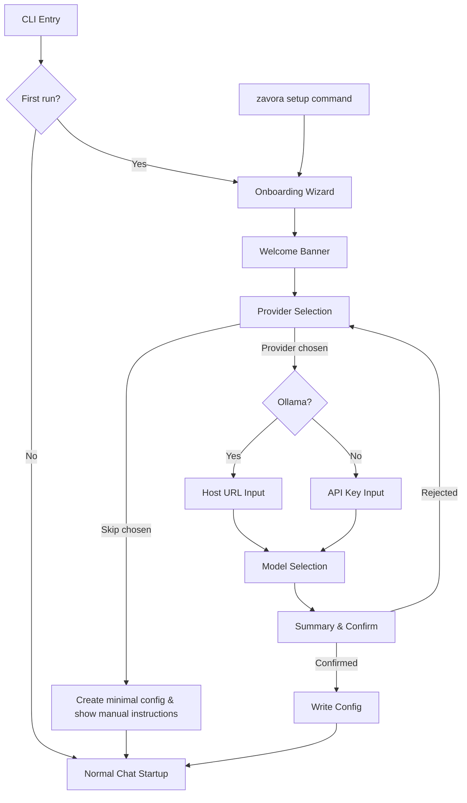

# Design Document: Provider Onboarding

## Overview

This design introduces an interactive onboarding wizard to zavora-cli that replaces the current static `print_onboarding()` welcome message. The wizard is a synchronous, terminal-based flow using stdin/stdout that guides users through provider selection, model selection, and API key entry. On completion it persists a fully functional default profile to `.zavora/config.toml`.

The wizard is implemented as a new `src/onboarding.rs` module with a public `run_onboarding_wizard()` function. It hooks into the existing first-run check in `run_chat()` and is also accessible via a new `setup` CLI subcommand. The design reuses the existing `Provider` enum, `model_picker_options()` catalog, `ProfileConfig`, and `ProfilesFile` TOML serialization — no new dependencies are required beyond what the codebase already uses.

## Architecture



## Components and Interfaces

### 1. `OnboardingResult` struct

Captures the user's selections from the wizard. Returned by `run_onboarding_wizard()`.

```rust
pub struct OnboardingResult {
    pub provider: Provider,
    pub model: String,
    pub api_key: Option<String>,      // None for Ollama
    pub ollama_host: Option<String>,   // Some only for Ollama
    pub skipped: bool,                 // true if user chose to skip
}
```

### 2. `run_onboarding_wizard()` function

Main entry point for the wizard. Orchestrates the flow.

```rust
/// Runs the interactive onboarding wizard.
/// If `existing` is Some, pre-populates selections (for `setup` re-run).
pub fn run_onboarding_wizard(existing: Option<&ProfileConfig>) -> Result<OnboardingResult>
```

### 3. `prompt_provider_selection()` function

Displays the provider list and reads user input. Returns `None` if the user chooses to skip.

```rust
fn prompt_provider_selection(default: Option<Provider>) -> Result<Option<Provider>>
```

Displays:
```
Select your AI provider:
  1. OpenAI
  2. Anthropic
  3. Google Gemini
  4. DeepSeek
  5. Groq
  6. Ollama (local)
  s. Skip setup

Enter selection [1-6, s]:
```

### 4. `prompt_model_selection()` function

Reuses the existing `model_picker_options()` from `chat.rs` to display models for the chosen provider. Marks the default model.

```rust
fn prompt_model_selection(provider: Provider, default_model: Option<&str>) -> Result<String>
```

Displays:
```
Select a model for OpenAI:
  1. gpt-4.1        (ctx=1M, balanced default) [default]
  2. gpt-5.3-codex  (ctx=400k, agentic coding, most capable)
  3. gpt-5-mini     (ctx=400k, fast low-latency)
  4. o3-mini        (ctx=200k, reasoning-focused)

Enter selection [1-4] or press Enter for default:
```

### 5. `prompt_api_key()` function

Reads an API key with masked input (characters replaced with `*`).

```rust
fn prompt_api_key(provider: Provider) -> Result<String>
```

Uses `crossterm` raw mode to read characters one at a time, printing `*` for each character. Backspace removes the last character. Enter submits.

### 6. `prompt_ollama_host()` function

Prompts for the Ollama host URL with a default value.

```rust
fn prompt_ollama_host(default: &str) -> Result<String>
```

### 7. `display_summary()` function

Shows a summary of selections and asks for confirmation.

```rust
fn display_summary(result: &OnboardingResult) -> Result<bool>
```

Displays:
```
Setup Summary:
  Provider: OpenAI
  Model:    gpt-4.1
  API Key:  sk-****...****abcd

Save this configuration? [Y/n]:
```

API key masking: show first 3 and last 4 characters, mask the rest with `****...****`. If the key is shorter than 10 characters, mask everything except the last 2.

### 8. `persist_onboarding_config()` function

Writes the onboarding result to `.zavora/config.toml`.

```rust
pub fn persist_onboarding_config(result: &OnboardingResult, config_path: &str) -> Result<()>
```

This function:
1. Creates the `.zavora` directory if it doesn't exist
2. Loads any existing `ProfilesFile` (to preserve other profiles)
3. Updates the `default` profile with provider, model, and stores the API key in the profile's dedicated field
4. Serializes to TOML and writes to disk

### 9. API Key Storage in Profile

The API key needs to be stored in the config file so users don't need environment variables. We extend `ProfileConfig` with an optional `api_key` field:

```rust
// Added to ProfileConfig
pub api_key: Option<String>,
```

The `resolve_model()` function in `provider.rs` is updated to check `cfg.api_key` before falling back to environment variables. This maintains backward compatibility — env vars still work, but the config file takes precedence for onboarded users.

### 10. `setup` CLI Subcommand

A new `Setup` variant is added to the `Commands` enum:

```rust
#[command(about = "Run the interactive provider setup wizard")]
Setup,
```

When invoked, it loads the existing profile (if any) and passes it to `run_onboarding_wizard()` with pre-populated defaults.

### 11. Integration with `run_chat()`

The existing first-run check in `run_chat()` is updated:

```rust
// Before (current):
if is_first_run(&workspace) {
    print_onboarding();
}

// After:
if is_first_run(&workspace) {
    let result = run_onboarding_wizard(None)?;
    persist_onboarding_config(&result, &cfg.config_path)?;
    // Reload config with new profile values
    // ...
}
```

## Data Models

### OnboardingResult

| Field | Type | Description |
|-------|------|-------------|
| `provider` | `Provider` | Selected provider enum variant |
| `model` | `String` | Selected model identifier |
| `api_key` | `Option<String>` | API key for cloud providers, None for Ollama |
| `ollama_host` | `Option<String>` | Host URL for Ollama, None for cloud providers |
| `skipped` | `bool` | Whether the user chose to skip onboarding |

### Extended ProfileConfig (new field)

| Field | Type | Description |
|-------|------|-------------|
| `api_key` | `Option<String>` | API key stored in profile, checked before env vars |

### Config File Format (TOML)

After onboarding, `.zavora/config.toml` looks like:

```toml
[profiles.default]
provider = "openai"
model = "gpt-4.1"
api_key = "sk-..."
```

For Ollama:

```toml
[profiles.default]
provider = "ollama"
model = "llama4"
# Ollama host stored via OLLAMA_HOST env var pattern or a new field
```

For Ollama, we add an `ollama_host` field to `ProfileConfig`:

```rust
pub ollama_host: Option<String>,
```

And update `resolve_model()` to check `cfg.ollama_host` before falling back to the `OLLAMA_HOST` env var.


## Correctness Properties

*A property is a characteristic or behavior that should hold true across all valid executions of a system — essentially, a formal statement about what the system should do. Properties serve as the bridge between human-readable specifications and machine-verifiable correctness guarantees.*

### Property 1: Provider selection input parsing

*For any* string input to the provider selection prompt, parsing it SHALL either return the correct `Provider` variant (if the input is a valid index 1–6) or return an error (if the input is anything else, excluding "s" for skip). The mapping from index to provider is deterministic and total over the valid range.

**Validates: Requirements 2.3, 2.4**

### Property 2: Model selection input parsing

*For any* provider and any string input to the model selection prompt, parsing it SHALL either: (a) return the default model for that provider if the input is empty, (b) return the model at the given index if the input is a valid numeric index within the provider's model list, or (c) return an error for all other inputs.

**Validates: Requirements 3.3, 3.4, 3.5**

### Property 3: Model catalog completeness

*For any* non-Auto provider, `model_picker_options()` SHALL return a non-empty list where every entry has a non-empty `id`, a non-empty `context_window`, and a non-empty `description`.

**Validates: Requirements 3.1**

### Property 4: API key validation

*For any* string, API key validation SHALL accept the string if and only if it contains at least one non-whitespace character. Strings composed entirely of whitespace (including the empty string) SHALL be rejected.

**Validates: Requirements 4.3, 4.4**

### Property 5: Configuration round-trip

*For any* valid `OnboardingResult` (with a non-Auto provider, a non-empty model, and either a non-empty API key or an Ollama host), persisting it via `persist_onboarding_config()` and then loading it via `load_profiles()` SHALL produce a `ProfileConfig` where the provider, model, and credential (api_key or ollama_host) match the original `OnboardingResult`.

**Validates: Requirements 6.1, 6.2, 6.3, 9.3**

### Property 6: Summary formatting completeness

*For any* valid `OnboardingResult` with a non-Ollama provider, the formatted summary string SHALL contain the provider name, the model name, and a masked representation of the API key that does not expose the full key. For Ollama results, the summary SHALL contain the provider name, model name, and the host URL.

**Validates: Requirements 7.1**

## Error Handling

| Scenario | Behavior |
|----------|----------|
| Invalid provider index input | Display "Invalid selection. Please enter a number 1–6 or 's' to skip." and re-prompt. |
| Invalid model index input | Display "Invalid selection. Please enter a number within the listed range or press Enter for default." and re-prompt. |
| Empty API key submitted | Display "API key cannot be empty. Please enter your key." and re-prompt. |
| Config file write failure | Display error with file path and OS error message, e.g., "Failed to write config to .zavora/config.toml: Permission denied". Return `Err` to caller. |
| Config directory creation failure | Display error with directory path and OS error. Return `Err` to caller. |
| stdin read failure | Return `Err` with context "failed to read user input". |
| Existing config file is malformed TOML (during `setup` re-run) | Load returns default empty profiles; wizard proceeds with no pre-populated values. Log a warning. |

All error paths use `anyhow::Result` with `.context()` for descriptive error chains, consistent with the rest of the codebase.

## Testing Strategy

### Property-Based Tests

Use the `proptest` crate for property-based testing. Each property test runs a minimum of 100 iterations.

Property tests target the pure logic functions that don't require terminal I/O:
- Provider selection parsing (Property 1)
- Model selection parsing (Property 2)
- Model catalog completeness (Property 3)
- API key validation (Property 4)
- Config round-trip via temp directory (Property 5)
- Summary formatting (Property 6)

Each test is tagged with: **Feature: provider-onboarding, Property {N}: {title}**

### Unit Tests

Unit tests complement property tests by covering:
- Specific examples: Ollama flow skips API key (Req 2.5), empty input selects default model (Req 3.3)
- Edge cases: first-run detection with/without `.zavora` directory (Req 1.1, 1.2), API key masking for very short keys
- Error conditions: write failure to read-only path (Req 6.4), skip flow produces minimal config (Req 8.2)
- Integration: `setup` command pre-populates from existing profile (Req 9.2)

### Test Organization

Tests live in `src/onboarding.rs` as a `#[cfg(test)] mod tests` block, following the codebase convention. Property tests use `proptest!` macro. Unit tests use standard `#[test]` functions. Config round-trip tests use `tempfile` for isolated filesystem operations.
