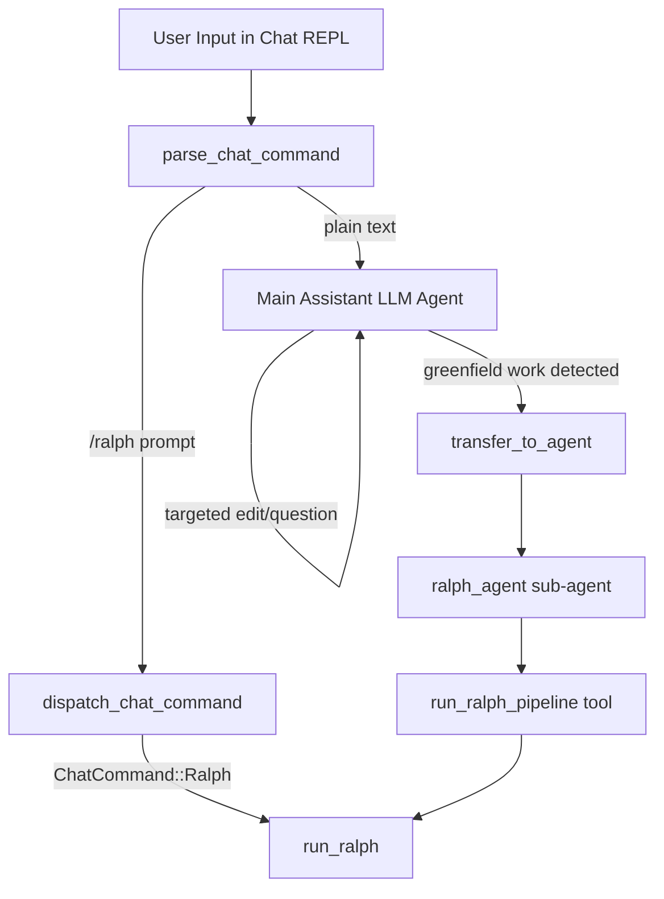

# Design Document: Ralph Orchestrator Routing

## Overview

This design adds Ralph as a first-class sub-agent within the zavora chat experience through two integration points:

1. A `/ralph <prompt>` slash command that directly invokes `run_ralph()` from the chat REPL, following the same pattern as `/orchestrate` and `/delegate`.
2. Ralph registered as an adk-rust sub-agent on the main assistant, so the LLM can autonomously route to Ralph via `transfer_to_agent` when it detects greenfield/multi-phase development work — no manual keyword classifier needed.

### What Already Exists (from ralph-subagent-integration spec)

The previous spec implemented Ralph as a **top-level CLI subcommand** (`zavora ralph <prompt>`). The following are already in place:
- `Commands::Ralph` variant in `src/cli.rs` with `--phase`, `--resume`, `--output-dir` flags
- `run_ralph()` async function in `src/ralph.rs` with `RalphConfigBridge`, `map_provider()`, `resolve_api_key()`, `map_ralph_phase()`
- "ralph" entry in `implicit_agent_map()` in `src/config.rs`
- Telemetry events: `ralph.started`, `ralph.completed`, `ralph.failed`

### What This Spec Adds

1. A **chat slash command** `/ralph <prompt>` — a new `ChatCommand::Ralph` variant and dispatch handler that calls the existing `run_ralph()` from within the interactive chat REPL.
2. **Ralph as an adk-rust sub-agent** — following the exact same pattern as `search_agent` in `src/agents/search.rs`, we build a Ralph LLM agent with a `run_ralph` tool and register it via `LlmAgentBuilder::sub_agent()`. When agent mode is active, the main assistant's LLM naturally decides to `transfer_to_agent("ralph_agent")` for greenfield work.

### Key Design Decision: LLM-Based Routing vs Manual Classifier

The existing codebase already uses LLM-based sub-agent routing via adk-rust's `transfer_to_agent` mechanism (see `search_agent`). Rather than building a brittle keyword-based `TaskClassifier`, we follow the same pattern: give the Ralph sub-agent a clear description and instruction, and let the LLM decide when to route. This is one line of code (`.sub_agent(ralph_agent)`) and leverages the LLM's natural language understanding for classification.

## Architecture



The `/ralph` command is a direct path: parse → dispatch → `run_ralph()`. No LLM involved.

For autonomous routing: the main assistant agent has `ralph_agent` registered as a sub-agent. When the LLM determines the user's request is greenfield/multi-phase development, it calls `transfer_to_agent("ralph_agent")`. The ralph_agent has a `run_ralph_pipeline` tool that invokes `run_ralph()`. This only happens when agent mode is active (the ralph sub-agent is conditionally attached).

## Components and Interfaces

### 1. ChatCommand::Ralph Variant

Add a new variant to the `ChatCommand` enum in `src/chat.rs`:

```rust
pub enum ChatCommand {
    // ... existing variants ...
    Ralph(String),
}
```

### 2. parse_chat_command Extension

Add a match arm in `parse_chat_command()`:

```rust
"ralph" => ParsedChatCommand::Command(ChatCommand::Ralph(arg.to_string())),
```

### 3. dispatch_chat_command Handler

Add a `ChatCommand::Ralph` arm in `dispatch_chat_command()`. This calls the existing `run_ralph()` from `src/ralph.rs` with no phase override, no resume, and no output directory — the simplest invocation path:

```rust
ChatCommand::Ralph(prompt) => {
    if prompt.trim().is_empty() {
        println!("Usage: /ralph <prompt>");
        println!("Runs the Ralph autonomous development pipeline.");
        return Ok(ChatCommandAction::Continue);
    }
    telemetry.emit("chat.ralph.invoked", json!({
        "provider": format!("{:?}", resolved_provider).to_ascii_lowercase(),
        "model": model_name.clone(),
    }));
    println!("Starting Ralph pipeline...");
    match crate::ralph::run_ralph(cfg, prompt, None, false, None, telemetry).await {
        Ok(()) => println!("Ralph pipeline completed."),
        Err(e) => eprintln!("Ralph pipeline failed: {e}"),
    }
    Ok(ChatCommandAction::Continue)
}
```

### 4. Ralph Sub-Agent (`src/agents/ralph_agent.rs`)

A new module that builds a Ralph LLM agent following the same pattern as `src/agents/search.rs`:

```rust
use adk_rust::prelude::*;
use anyhow::Result;
use std::sync::Arc;

const RALPH_AGENT_INSTRUCTION: &str = r#"You are the Ralph autonomous development agent.

You handle greenfield project creation, multi-phase development, and large-scale scaffolding tasks.
When given a development task, use the run_ralph_pipeline tool to execute the full Ralph pipeline
(PRD → Architect → Implementation).

You should be used for:
- Building new projects or applications from scratch
- Multi-file scaffolding and project setup
- Multi-phase development work (requirements → design → implementation)
- Large-scale feature development that needs structured planning

You should NOT be used for:
- Quick bug fixes or targeted edits
- Simple questions or explanations
- Single-file changes
- Debugging existing code
"#;

pub fn build_ralph_agent(model: Arc<dyn Llm>) -> Result<Arc<dyn Agent>> {
    let ralph_tool = RalphPipelineTool::new();

    let agent = LlmAgentBuilder::new("ralph_agent")
        .description(
            "Ralph autonomous development pipeline for greenfield projects \
             and multi-phase development work"
        )
        .instruction(RALPH_AGENT_INSTRUCTION)
        .model(model)
        .tool(Arc::new(ralph_tool))
        .build()?;

    Ok(Arc::new(agent))
}
```

### 5. RalphPipelineTool

A tool that wraps `run_ralph()` so the Ralph sub-agent can invoke the pipeline:

```rust
pub struct RalphPipelineTool;

impl RalphPipelineTool {
    pub fn new() -> Self { Self }
}

impl Tool for RalphPipelineTool {
    fn name(&self) -> &str { "run_ralph_pipeline" }

    fn description(&self) -> &str {
        "Execute the Ralph autonomous development pipeline (PRD → Architect → Implementation) \
         for a given development prompt."
    }

    fn parameters_schema(&self) -> Option<Value> {
        Some(json!({
            "type": "object",
            "properties": {
                "prompt": {
                    "type": "string",
                    "description": "The development task description"
                }
            },
            "required": ["prompt"]
        }))
    }

    async fn execute(&self, _ctx: Arc<dyn ToolContext>, args: Value) -> adk_rust::Result<Value> {
        let prompt = args["prompt"].as_str().unwrap_or_default().to_string();
        // Retrieve RuntimeConfig and TelemetrySink from thread-local or global state
        // and call run_ralph()
        // ...
    }
}
```

The tool execution needs access to `RuntimeConfig` and `TelemetrySink`. These can be passed via a shared `Arc` stored in the tool struct at construction time, similar to how other tools in the codebase access shared state.

### 6. Conditional Sub-Agent Registration in Runner

In `src/runner.rs`, the ralph sub-agent is conditionally attached when agent mode is active:

```rust
// In build_agent()
let search_subagent = build_search_subagent_for_provider(runtime_cfg, model.clone());
let ralph_subagent = build_ralph_subagent_if_agent_mode(runtime_cfg, model.clone());

// ... existing builder setup ...

if let Some(search_agent) = search_subagent {
    builder = builder.sub_agent(search_agent);
}
if let Some(ralph_agent) = ralph_subagent {
    builder = builder.sub_agent(ralph_agent);
}
```

```rust
fn build_ralph_subagent_if_agent_mode(
    runtime_cfg: Option<&RuntimeConfig>,
    model: Arc<dyn Llm>,
) -> Option<Arc<dyn Agent>> {
    use crate::tools::confirming::is_agent_mode;
    if !is_agent_mode() {
        return None;
    }
    match crate::agents::ralph_agent::build_ralph_agent(model) {
        Ok(agent) => Some(agent),
        Err(err) => {
            tracing::warn!("failed to build ralph sub-agent: {}", err);
            None
        }
    }
}
```

### 7. System Prompt Update

Update the system prompt in `src/runner.rs` to mention the ralph_agent in the SUBAGENTS section:

```
SUBAGENTS (automatically available when conditions met):
- search_agent: For news, current events, and web searches (enabled only with --provider gemini)
- ralph_agent: For greenfield projects and multi-phase development (enabled only in agent mode)
```

### 8. Help Text Update

Add to `print_chat_help()`:

```rust
println!("  {CYAN}/ralph{RESET} <prompt>     {DIM}run Ralph autonomous dev pipeline{RESET}");
```

Placed after the `/orchestrate` line.

## Data Models

### ChatCommand::Ralph

A simple string-carrying variant, identical in shape to `ChatCommand::Orchestrate(String)` and `ChatCommand::Delegate(String)`.

### RalphPipelineTool State

```rust
pub struct RalphPipelineTool {
    runtime_config: Arc<RuntimeConfig>,
    telemetry: Arc<TelemetrySink>,
}
```

The tool holds `Arc` references to the config and telemetry sink, set at construction time when the sub-agent is built. This avoids global state.

### No New Data Models for Routing

Since routing is handled by adk-rust's built-in `transfer_to_agent` mechanism, there is no `Classification` enum, no `TaskClassifier`, and no `RoutingContext`. The LLM decides when to route based on the sub-agent's description and instruction.


## Correctness Properties

*A property is a characteristic or behavior that should hold true across all valid executions of a system — essentially, a formal statement about what the system should do. Properties serve as the bridge between human-readable specifications and machine-verifiable correctness guarantees.*

The design shift to LLM-based routing (via adk-rust's `transfer_to_agent`) means the classification logic is handled by the LLM, not by a deterministic function. This eliminates the keyword-based `TaskClassifier` and its associated testable properties. The remaining testable property is the command parser.

### Property 1: Parse round-trip for /ralph command

From prework 1.1: The parser must correctly extract the prompt from any `/ralph <prompt>` input. This is a universal property — for all possible prompt strings, parsing should produce the correct variant with the exact prompt text.

*For any* non-empty string `prompt`, calling `parse_chat_command(&format!("/ralph {}", prompt))` should return `ParsedChatCommand::Command(ChatCommand::Ralph(s))` where `s` equals `prompt`.

**Validates: Requirements 1.1**

### Note on Routing Properties

Requirements 2.x and 3.x describe classification and routing behavior. In the updated design, this is handled by the LLM's natural language understanding via `transfer_to_agent`. LLM behavior is not deterministically testable as a property. Instead, these requirements are validated through:
- The ralph sub-agent's description and instruction (which guide the LLM's routing decisions)
- The conditional attachment logic (ralph sub-agent only attached when agent mode is active)
- Integration tests that verify the sub-agent is registered correctly

## Error Handling

### /ralph Command Errors

- If `run_ralph()` returns an `Err`, the dispatch handler prints the error to stderr and returns `ChatCommandAction::Continue`. The chat REPL continues normally.
- If the provider is unsupported by Ralph (e.g., Deepseek, Groq), `RalphConfigBridge::from_runtime_config()` returns an error which surfaces through the same path.

### RalphPipelineTool Errors

- If `run_ralph()` fails when invoked via the tool, the tool returns an error value through the adk-rust tool result mechanism. The LLM agent sees the error and can report it to the user.
- The main assistant is not affected — tool errors don't crash the agent loop.

### Sub-Agent Registration Errors

- If `build_ralph_agent()` fails (e.g., model incompatibility), the error is logged via `tracing::warn!` and the ralph sub-agent is simply not attached. The assistant continues without Ralph routing capability.

### Agent Mode Guard

- When agent mode is off, `build_ralph_subagent_if_agent_mode()` returns `None`. The assistant has no ralph sub-agent and cannot transfer to it. This is the safe default.

## Testing Strategy

### Unit Tests

Unit tests cover specific examples and edge cases:

- `/ralph` parsing: empty arg returns `ChatCommand::Ralph("")`, single word prompt, multi-word prompt, leading/trailing whitespace
- `/ralph` dispatch: empty prompt shows usage message, non-empty prompt calls `run_ralph`
- Help text: `/ralph` appears in `print_chat_help()` output
- Sub-agent registration: `build_ralph_subagent_if_agent_mode()` returns `None` when agent mode is off
- `RalphPipelineTool`: correct name, description, and parameter schema
- Telemetry: `chat.ralph.invoked` event emitted on `/ralph` dispatch

### Property-Based Tests

Property-based tests use the `proptest` crate with minimum 100 iterations per property.

- **Feature: ralph-orchestrator-routing, Property 1: Parse round-trip for /ralph command** — Generate arbitrary non-empty strings, format as `/ralph {s}`, parse, verify result is `ChatCommand::Ralph` with matching prompt text.

### Test Configuration

```toml
# In Cargo.toml [dev-dependencies]
proptest = "1"
```

Each property test runs a minimum of 100 cases. Tests are annotated with comments referencing the property number and requirements clause.
