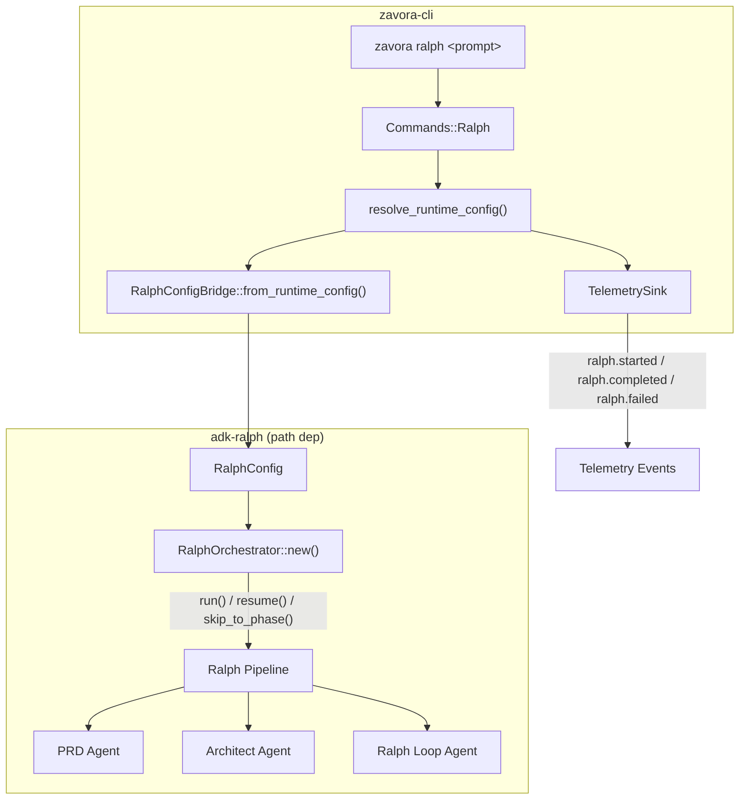

# Design Document: Ralph Sub-Agent Integration

## Overview

This design describes how to integrate the adk-ralph autonomous development system into zavora-cli as a sub-agent. The integration adds a `zavora ralph <prompt>` CLI command that invokes Ralph's three-phase pipeline (PRD → Architect → Ralph Loop) while reusing zavora's provider configuration, telemetry, and agent catalog infrastructure.

The key architectural decision is to treat Ralph as an opaque pipeline invoked through a thin adapter layer, rather than deeply merging Ralph's internals into zavora's agent system. This keeps the integration surface small and allows both projects to evolve independently.

### Key Design Decisions

1. **Path dependency**: adk-ralph is added as a Cargo path dependency. This requires adk-ralph to be updated to adk-rust 0.3.0 first (or the path dependency must point to a compatible branch).
2. **Config bridge pattern**: A `RalphConfigBridge` translates zavora's `RuntimeConfig` into Ralph's `RalphConfig`, avoiding dual configuration.
3. **Isolated tool context**: Ralph runs with its own tool set. No tool sharing or merging with zavora's built-in tools.
4. **Thin CLI adapter**: A new `Commands::Ralph` variant and `run_ralph()` function follow the same patterns as `Commands::Ask` and `Commands::Workflow`.

## Architecture



## Components and Interfaces

### 1. CLI Extension (`src/cli.rs`)

Add a new `Ralph` variant to the `Commands` enum:

```rust
#[derive(Debug, Subcommand)]
pub enum Commands {
    // ... existing variants ...
    
    #[command(about = "Run the Ralph autonomous development pipeline")]
    Ralph {
        #[arg(required_unless_present = "resume")]
        prompt: Vec<String>,
        
        #[arg(long, value_enum)]
        phase: Option<RalphPhase>,
        
        #[arg(long, default_value_t = false)]
        resume: bool,
        
        #[arg(long)]
        output_dir: Option<String>,
    },
}

#[derive(Debug, Clone, Copy, ValueEnum)]
pub enum RalphPhase {
    Prd,
    Architect,
    Loop,
}
```

### 2. Configuration Bridge (`src/ralph.rs`)

A module that translates zavora's `RuntimeConfig` into Ralph's `RalphConfig`:

```rust
pub struct RalphConfigBridge;

impl RalphConfigBridge {
    pub fn from_runtime_config(
        cfg: &RuntimeConfig,
        output_dir: Option<&str>,
    ) -> Result<ralph::RalphConfig> {
        let provider = map_provider(cfg.provider)?;
        let api_key = resolve_api_key(cfg)?;
        let model = cfg.model.clone();
        let output = output_dir
            .map(PathBuf::from)
            .unwrap_or_else(|| std::env::current_dir().unwrap_or_default());
        
        Ok(ralph::RalphConfig {
            model_provider: provider,
            api_key,
            model,
            output_dir: output,
            // ... map remaining fields
        })
    }
}

fn map_provider(provider: Provider) -> Result<String> {
    match provider {
        Provider::Openai => Ok("openai".to_string()),
        Provider::Anthropic => Ok("anthropic".to_string()),
        Provider::Deepseek => Ok("deepseek".to_string()),
        Provider::Groq => Ok("groq".to_string()),
        Provider::Ollama => Ok("ollama".to_string()),
        Provider::Gemini => Ok("gemini".to_string()),
        Provider::Auto => Err(anyhow!("auto provider must be resolved before ralph invocation")),
    }
}

fn resolve_api_key(cfg: &RuntimeConfig) -> Result<String> {
    cfg.api_key.clone()
        .or_else(|| match cfg.provider {
            Provider::Openai => std::env::var("OPENAI_API_KEY").ok(),
            Provider::Anthropic => std::env::var("ANTHROPIC_API_KEY").ok(),
            // ... etc
            _ => None,
        })
        .context("API key required for Ralph pipeline")
}
```

### 3. Pipeline Runner (`src/ralph.rs`)

The `run_ralph()` async function orchestrates the pipeline execution:

```rust
pub async fn run_ralph(
    cfg: &RuntimeConfig,
    prompt: String,
    phase: Option<RalphPhase>,
    resume: bool,
    output_dir: Option<String>,
    telemetry: &TelemetrySink,
) -> Result<()> {
    let ralph_config = RalphConfigBridge::from_runtime_config(
        cfg,
        output_dir.as_deref(),
    )?;
    
    let orchestrator = ralph::RalphOrchestrator::new(ralph_config);
    
    telemetry.emit("ralph.started", json!({
        "provider": format!("{:?}", cfg.provider).to_ascii_lowercase(),
        "model": cfg.model.clone().unwrap_or_default(),
        "phase": phase.map(|p| format!("{:?}", p).to_ascii_lowercase()),
        "resume": resume,
    }));
    
    let result = if resume {
        orchestrator.resume().await
    } else if let Some(phase) = phase {
        let ralph_phase = map_ralph_phase(phase);
        orchestrator.skip_to_phase(ralph_phase, &prompt).await
    } else {
        orchestrator.run(&prompt).await
    };
    
    match &result {
        Ok(_) => telemetry.emit("ralph.completed", json!({"status": "ok"})),
        Err(e) => telemetry.emit("ralph.failed", json!({"error": e.to_string()})),
    }
    
    result
}
```

### 4. Agent Catalog Entry (`src/config.rs`)

Extend `implicit_agent_map()` to include a "ralph" agent:

```rust
pub fn implicit_agent_map() -> HashMap<String, ResolvedAgent> {
    let mut resolved = HashMap::new();
    // ... existing "default" agent ...
    
    resolved.insert(
        "ralph".to_string(),
        ResolvedAgent {
            name: "ralph".to_string(),
            source: AgentSource::Implicit,
            config: AgentFileConfig {
                description: Some(
                    "Ralph autonomous development pipeline (PRD → Architect → Loop)".to_string()
                ),
                instruction: None,
                provider: None,
                model: None,
                tool_confirmation_mode: None,
                resource_paths: Vec::new(),
                allow_tools: Vec::new(),
                deny_tools: Vec::new(),
                hooks: HashMap::new(),
            },
        },
    );
    
    resolved
}
```

### 5. Main Integration (`src/main.rs`)

Add the `Commands::Ralph` match arm in `run_cli()`:

```rust
Commands::Ralph { prompt, phase, resume, output_dir } => {
    let prompt = prompt.join(" ");
    if !resume {
        enforce_prompt_limit(&prompt, cfg.max_prompt_chars)?;
    }
    run_ralph(&cfg, prompt, phase, resume, output_dir, &telemetry).await?;
    Ok(())
}
```

## Data Models

### RalphConfigBridge Mapping

| Zavora RuntimeConfig Field | Ralph Config Field | Mapping Logic |
|---|---|---|
| `provider` | `model_provider` | Enum name to lowercase string |
| `model` | `model` | Direct pass-through (Option) |
| `api_key` / env fallback | `api_key` | Profile key, then env var fallback |
| CLI `--output-dir` | `output_dir` | Flag value or cwd default |

### RalphPhase Mapping

| Zavora RalphPhase | Ralph Phase Enum |
|---|---|
| `RalphPhase::Prd` | Ralph's PRD phase identifier |
| `RalphPhase::Architect` | Ralph's Architect phase identifier |
| `RalphPhase::Loop` | Ralph's Loop phase identifier |

### Telemetry Events

| Event Name | Payload Fields | When Emitted |
|---|---|---|
| `ralph.started` | provider, model, phase, resume | Pipeline invocation begins |
| `ralph.completed` | status, duration_ms | Pipeline finishes successfully |
| `ralph.failed` | error, duration_ms | Pipeline encounters an error |


## Correctness Properties

*A property is a characteristic or behavior that should hold true across all valid executions of a system — essentially, a formal statement about what the system should do. Properties serve as the bridge between human-readable specifications and machine-verifiable correctness guarantees.*

### Property 1: CLI parsing accepts any non-empty prompt

*For any* non-empty string used as a prompt argument, parsing `zavora ralph <prompt>` should produce a `Commands::Ralph` variant containing that prompt text.

**Validates: Requirements 2.1**

### Property 2: Config bridge preserves provider settings

*For any* valid `RuntimeConfig` with a supported provider, calling `RalphConfigBridge::from_runtime_config()` should produce a `RalphConfig` where:
- The `model_provider` field matches the lowercase name of the input provider
- The `model` field matches the input model (if present)
- The `api_key` field matches the input API key (if present)

**Validates: Requirements 3.1, 3.2, 3.3, 3.5**

### Property 3: Config bridge rejects unsupported providers

*For any* provider value not supported by Ralph, calling `RalphConfigBridge::from_runtime_config()` should return an error that contains the unsupported provider name.

**Validates: Requirements 3.4**

### Property 4: Pipeline errors propagate to caller

*For any* error returned by the Ralph orchestrator, `run_ralph()` should return an `Err` result containing the original error message.

**Validates: Requirements 4.4**

### Property 5: Telemetry start event contains required fields

*For any* provider and model combination, the telemetry event emitted at ralph command start should contain non-empty "provider" and "model" fields matching the input configuration.

**Validates: Requirements 6.1**

## Error Handling

| Error Condition | Handling Strategy | User-Facing Message |
|---|---|---|
| adk-ralph dependency not found | Compile-time error | Cargo build error with path hint |
| No prompt provided (without --resume) | Clap validation error | "error: the following required arguments were not provided: \<prompt\>" |
| Unsupported provider for Ralph | `RalphConfigBridge` returns `Err` | "provider '{name}' is not supported by Ralph. Supported: openai, anthropic, deepseek, groq, ollama, gemini" |
| Missing API key | `resolve_api_key()` returns `Err` | "API key required for Ralph pipeline. Set it in your profile or via environment variable." |
| Ralph pipeline phase error | Error propagated from `RalphOrchestrator` | Ralph's error message displayed, non-zero exit |
| Resume with no checkpoint | Error from `orchestrator.resume()` | "No checkpoint found to resume from." |
| Invalid --phase value | Clap validation error | "invalid value '{val}' for '--phase': valid values: prd, architect, loop" |

## Testing Strategy

### Unit Tests

Unit tests cover specific examples and edge cases:

- CLI parsing: verify `Commands::Ralph` is produced with correct fields for known inputs
- CLI parsing: verify `--phase prd`, `--phase architect`, `--phase loop` each produce the correct `RalphPhase`
- CLI parsing: verify missing prompt without `--resume` produces an error
- Config bridge: verify each supported provider maps correctly (one test per provider)
- Config bridge: verify unsupported provider returns descriptive error
- Agent catalog: verify `implicit_agent_map()` contains "ralph" with correct metadata
- Telemetry: verify start/complete/fail events contain expected fields

### Property-Based Tests

Property-based tests use the `proptest` crate (already compatible with the Rust ecosystem) with minimum 100 iterations per property.

Each property test references its design document property:

- **Feature: ralph-subagent-integration, Property 1: CLI parsing accepts any non-empty prompt** — Generate arbitrary non-empty strings, parse as ralph command args, verify Commands::Ralph is produced
- **Feature: ralph-subagent-integration, Property 2: Config bridge preserves provider settings** — Generate arbitrary RuntimeConfig values with supported providers, verify RalphConfig fields match
- **Feature: ralph-subagent-integration, Property 3: Config bridge rejects unsupported providers** — Generate RuntimeConfig values with unsupported providers, verify error is returned
- **Feature: ralph-subagent-integration, Property 4: Pipeline errors propagate to caller** — Generate arbitrary error messages, mock orchestrator to return them, verify run_ralph returns matching Err
- **Feature: ralph-subagent-integration, Property 5: Telemetry start event contains required fields** — Generate arbitrary provider/model pairs, verify telemetry event payload contains matching fields

### Test Configuration

- Library: `proptest` (Rust property-based testing)
- Minimum iterations: 100 per property
- Test location: `tests/ralph_integration.rs` for integration tests, inline `#[cfg(test)]` modules for unit tests
